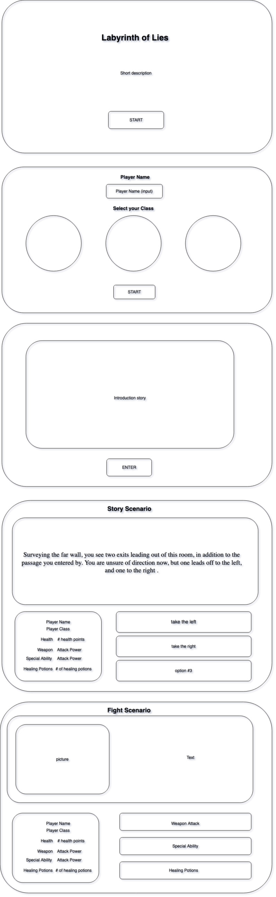

# Labyrinth of Lies

### App Demo: www.linkegoeshere.com

---

## Concept:

Labyrinth of Lies is a "choose your own adventure" RPG style game. 
Players will have the choice to select a character class and set their character name.
Players will make choices on how to navigate an underground labyrinth, ocasionally fighting monsters. 
Players' choices will actively affect the outcome of the game.
If a player dies, the game will start over from the beginning.

## Technologies Used:

* HTML
* CSS
* JavaScript 

##### Credits:

    Unsplash.com
    unDraw.co
    Slideshow Repo

## Approach:

#### Overview
Description of how you approach the game development. Here you will add all the development phases, from wireframes to code sample. 

#### Wireframe



Color Pallet:

```
    #tbd
```

#### User stories

As an user I expect to see ...

#### Development Plans

##### Initial Plan
I want to write the game in a way that allows me to easily expand the storyline if needed, without having to modify a huge if/else tree. The key to this would be creating a Scenario class that will update the DOM elements according to the particular story and options that the player has to make. Clicking a button in the browser will then run a function that pulls up the next scenario. 

#### MVP

MVP ONE
* Start screen
  * Player can select start button to start game
* Play screen
  * Player can see story and make choices
  * Display player stats

MVP TWO
* Player can fight monsters
* Player can heal
* Longer storyline

MVP THREE
* Create additional setup screens
  * Player can input their name
  * Player can select a class to play as, each class has different stats

MVP FOUR
* Display monster pictures
  
#### Stretch goals

* Find additional health potions inside the labyrinth
* Find better weapons inside the labyrinth
* Add ability to rest to restore health to full 
* Introduce luck element, make players roll a virtual die to determine the outcome.
* There is a chance that Monsters will heal
* Changing labyrinth. Selecting the same option might yield different results based on chance with every playthrough. 
* Expand storyline

## Challenges:

Small description of a challenge you faced. 


### App Demo: www.linkegoeshere.com
